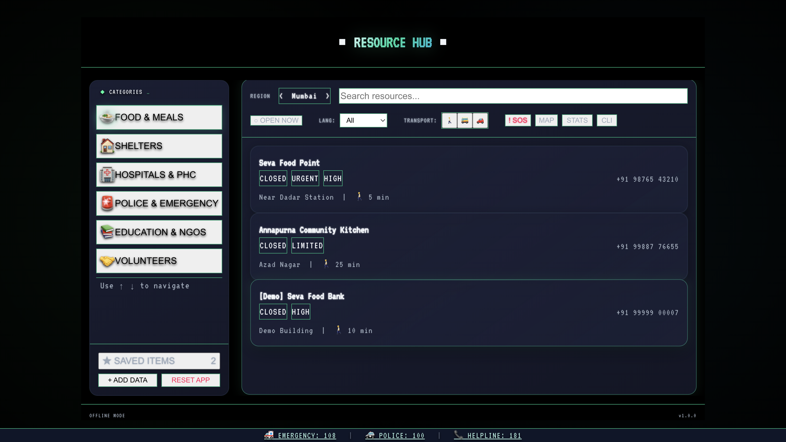
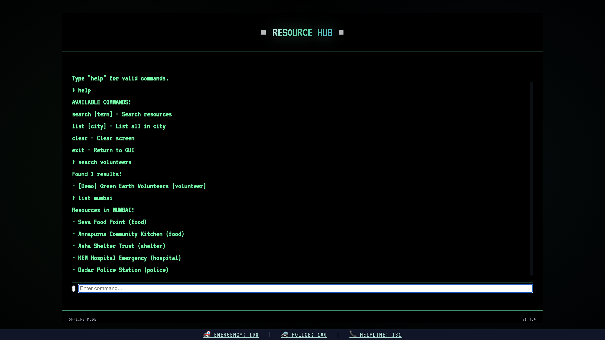

<div align="center">

# 🆘 SOS: System of Support

### **Access help. Anywhere. Anytime.**

*An offline-first community resource finder built for the people who need it most.*

[](https://react.dev)
[](https://typescriptlang.org)
[](https://vitejs.dev)
[](https://web.dev/progressive-web-apps/)

</div>

---

## 🌍 What is SOS?

SOS is a **Progressive Web App** that helps people across 7 Indian cities quickly find:

- 🍱 **Food centres & community kitchens**
- 🏠 **Emergency shelters & night refuges**
- 🏥 **Hospitals, PHCs & urgent medical care**
- 📚 **Education & skill-building resources**
- 👮 **Police, legal aid & dispute resolution**
- 🤝 **NGOs, volunteer corps & counselling**

Designed to work **without internet access** — once loaded, all data is available offline. No server. No tracking. No sign-up.

---

## ✨ Key Features

| Feature | Description |
|---|---|
| 🔌 **Offline-first PWA** | Service worker pre-caches the app shell; works on airplane mode |
| 🗺️ **7 Indian cities** | Mumbai, Delhi, Pune, Bangalore, Chennai, Hyderabad, **Kolkata** |
| 🔍 **Smart search + filters** | Filter by Open Now, language, and transport mode |
| 🧠 **Service-Request Mode** | Type naturally — *"I need food near Dadar"* — and the app infers the category |
| 🚨 **Emergency mode** | One keypress (`!`) surfaces high-priority urgent resources first |
| 💻 **CLI mode** | Terminal-style command interface (`Shift+C`) |
| 📍 **Transport estimates** | Walk / bus / car time estimates per resource |
| ⭐ **Favorites** | Save resources locally — no account needed |
| 🌐 **Language filter** | Find help in Hindi, Tamil, Bengali, Urdu, and more |
| 🕐 **Live "Open Now"** | Real-time check against multi-range resource hours |
| 🟢 **Freshness badges** | Shows how recently each entry was verified |
| 📤 **Share resource** | Copy a pre-formatted SMS/clipboard summary with one tap |
| 🤝 **Volunteer sign-up** | Generate a ready-to-send sign-up message for any volunteer role |
| 🖨️ **Print emergency sheet** | One-click printable B&W card with top 5 resources |
| ☀️ **Dark / Light mode** | Toggle for bright outdoor use |
| 🔴 **Emergency colour theme** | High-contrast red pulse when emergency mode is active |
| 🔒 **Privacy-first** | All user data stays on-device via `localStorage` — nothing leaves your browser |

---

## 🖥️ Screenshots

| Terminal Hub (Dark) | CLI Mode |
|---|---|
|  |  |

---

## 🛠️ Tech Stack

```
React 19 + TypeScript   — UI and strict type safety
Vite 7                  — Lightning-fast dev/build
Vanilla CSS             — Custom design system (no Tailwind)
Web Audio API           — Retro terminal sound effects
Service Worker          — Offline cache-first strategy
localStorage            — Privacy-first local persistence
```

---

## 📁 Project Structure

```
src/
├── App.tsx                       # Root — state, keyboard nav, theme, print
├── App.css                       # Component utility classes
├── index.css                     # CSS variables, dark/light themes, animations
├── main.tsx                      # React entry point
│
├── components/
│   ├── TerminalLayout.tsx        # CRT-style outer shell
│   ├── Sidebar.tsx               # Category navigation panel
│   ├── ConsentDialog.tsx         # Privacy consent overlay
│   ├── HelpOverlay.tsx           # Keyboard shortcuts reference
│   ├── NotificationBanner.tsx    # Transient status messages
│   ├── AsciiMap.tsx              # ASCII city map view
│   ├── StatsDashboard.tsx        # Usage stats panel
│   ├── CliMode.tsx               # Text-command terminal interface
│   ├── Typewriter.tsx            # Animated typewriter effect
│   ├── ResourceSubmission.tsx    # User-reported resource form
│   └── views/
│       ├── ResourceDetail.tsx    # Full resource detail view + volunteer CTA
│       └── ResourceList.tsx      # Scrollable resource card list
│
├── data/
│   └── resources.ts              # All resource data — typed, 7 cities
│
└── hooks/
    ├── useResourceFilter.ts      # Filtering, sorting, Service-Request Mode
    ├── useLocalStorage.ts        # Persistence & consent management
    └── useSound.ts               # Web Audio API sound effects

public/
├── sw.js                         # Service worker (cache-first offline)
├── manifest.json                 # PWA manifest
└── sos.svg                       # Branded favicon

screenshots/
├── gui.png                       # Hub view screenshot
└── cli.png                       # CLI mode screenshot
```

---

## ⚙️ Requirements

- **Node.js 20+** — required for Vite 7
- **npm** (or pnpm / yarn)

> `.nvmrc` is pre-configured. Run `nvm use` to auto-switch.

---

## ▶️ Running Locally

```bash
git clone https://github.com/nishtha-agarwal-211/SOS-System-of-Support-
cd SOS-System-of-Support-
nvm use          # switch to Node 20
npm install
npm run dev      # → http://localhost:5173
```

**Production build:**
```bash
npm run build    # output → dist/
npm run preview  # preview locally
```

---

## 🧠 Service-Request Mode

Type naturally in the search bar — SOS will understand:

| What you type | What happens |
|---|---|
| `"I need food near Dadar"` | Filters to **Food** resources |
| `"looking for shelter tonight"` | Filters to **Shelter** resources |
| `"doctor ambulance"` | Filters to **Hospital** resources |
| `"feeling unsafe, harassed"` | Filters to **Police** resources |
| `"skill training course"` | Filters to **Education** resources |

---

## ⌨️ Keyboard Navigation

Fully operable without a mouse.

| Key | Action |
|---|---|
| `↑` `↓` | Navigate resources / categories |
| `→` `←` | Change city |
| `Tab` | Switch focus: Sidebar ↔ Content |
| `Enter` | Open selected resource |
| `Esc` | Go back |
| `!` | Toggle Emergency Mode |
| `O` | Toggle Open Now filter |
| `F` | Favourite selected resource |
| `Shift+C` | Open CLI mode |
| `Shift+H` | Show help overlay |

---

## 🖨️ Print Emergency Sheet

Click **⎙ PRINT** in the filter bar to generate a printable, B&W-optimised page of the top 5 currently filtered resources — with name, phone, address, hours, and services. Designed for communities without reliable internet.

---

## 🤝 Volunteer Sign-Up Flow

On any resource detail page with volunteer info, click **📋 Generate Sign-Up Message** to copy a ready-to-send message to your clipboard:

```
Hi! I would like to volunteer for the "Cooking & Serving" position at Maa Annapurna Free Kitchen.

My name: _____
Contact: _____

Reaching out via: +91 33 2641 0000
```

---

## 🏆 Built For

This project was submitted under the **DevForge Hackathon** track.

**Problem Statement:** How do we give marginalised communities — people without smartphones, stable internet, or technical literacy — reliable access to the resources that could save their lives?

**Our Answer:** A terminal-aesthetic, offline-first PWA that treats connection-free access as a first-class requirement, not an afterthought.

---

<div align="center">
  Made with 💚 by <a href="https://github.com/nishtha-agarwal-211">Nishtha Agarwal</a>
</div>
